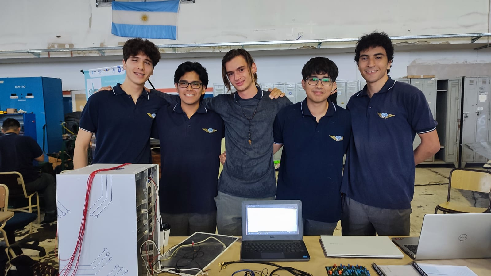

# BrainStream-EEG

## ¿Que es?
Brainstream es un proyecto en el que registramos y controlamos las respeustas del cerebro ante diferentes estimulos

## ¿Como funciona?
El usuario que disponga de este instrumento colocara electrodos en su cabeza para poder llevar a cabo un electroencefalograma, que se muestra en tiempo real en una pagina web, y posteriormente poder acceder a un historial desde cualquier computadora

## Contacto
- Email: brainstreamproject@gmail.com
- Instagram: @proyecto.brainstream
- LinkedIn: https://www.linkedin.com/company/brainstream-arg/about/

### Rosales Porst Agustín

📧 aprosalesporst@gmail.com

### Ortuño Alejandro

📧 alejandrogonzalez200474@yahoo.com

### Kaufmann Thomas

📧 thomibernal@gmail.com

### Przybylski Federico

📧 fedeprzy@gmail.com

### Juares Agustín

📧 juaresagustin12804@gmail.com

## Documentación
- La informacion de [PCB](/Hardware) esta disponible en formato de imagen
- El código se secciona en [Webpage](/Webpage) y [Microcontrolador](/Raspberry_code)
